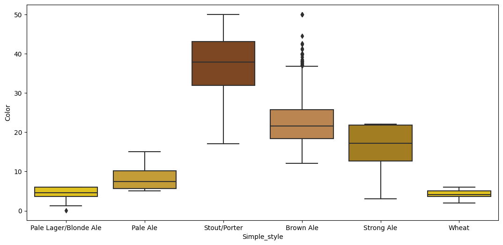
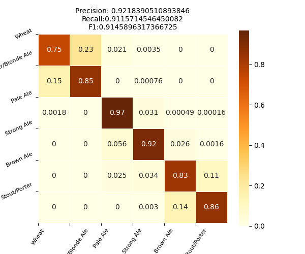
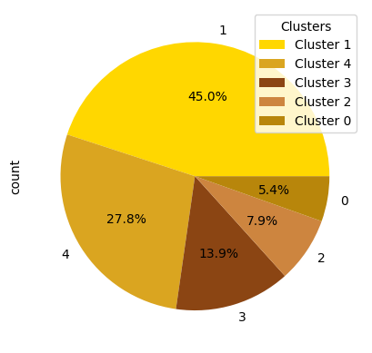
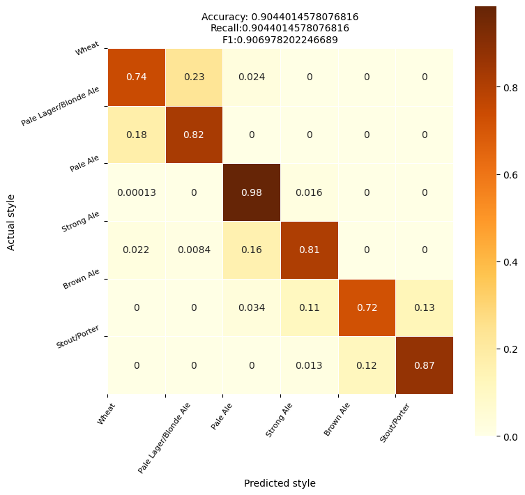
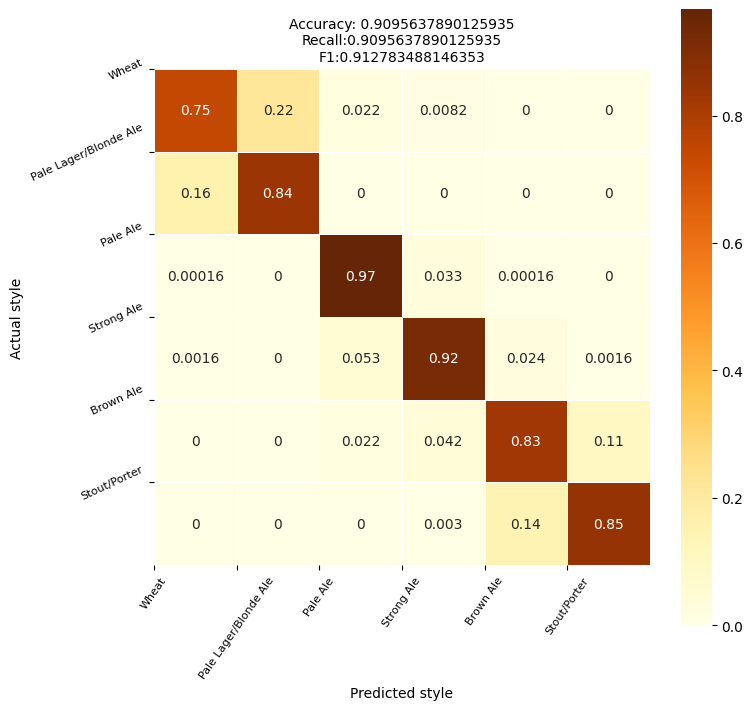

# Project Memo

Inicialmente se disponía de un dataset con las siguientes columnas:
```Python
['BeerID', 'Name', 'URL', 'Style', 'StyleID', 'Size(L)', 'OG', 'FG',
       'ABV', 'IBU', 'Color', 'BoilSize', 'BoilTime', 'BoilGravity',
       'Efficiency', 'MashThickness', 'SugarScale', 'BrewMethod', 'PitchRate',
       'PrimaryTemp', 'PrimingMethod', 'PrimingAmount', 'UserId']
```

La procedencia de los datos, [Brewersfriend.com](https://www.brewersfriend.com/beer-charts/), es una web orientada a las recetas de cervezas artesanales para que los aficionados las fabriquen y publiquen.

### Limpieza de datos

(Detalles sobre este procedimiento en el archivo [02limpieza.ipynb]('../notebooks/02limpieza.ipynb'))
Tras ver las correlaciones de los datos en un mapa de calor, tanto con los coeficientes de **Pearson, como de Kendall y Spearman**, descarté las columnas claramente innecesarias.

También probé métodos como el **OneHot Encoder** o el **Label Encoder** para otras columans con ánimo de lograr alguna relación menos obvia, pero no sirvió de mucho.

Así, finalmente las columnas interesantes para el modelo resultaron ser solamente:
+ Alcohol By Volume (ABV)
+ International Bitterness Units (IBU)
+ Color (SRM)

Una vez determinadas las variables con las que trabajar, se pasa a la limpieza de los datos:
+ **Mapeo exhaustivo de los tipos de cerveza**. Inicialmente había 175 tipos de cerveza en el dataset, que se clasificaron en seis estilos principales (aunque algunos se eliminaron por no encajar en ninguno o ser demasiado peculiares):
    - Wheat (blanca de trigo)
    - Pale Lager/Blonde Ale
    - Pale Ale
    - Strong Ale
    - Brown Ale
    - Stout/Porter
+ (Estos tipos se utilizaron para asignar valores numéricos ordenados por color. Después repetí el mismo proceso para ordenarlas por grado de amargor, pero los resultados no fueron tan concluyentes, por lo que el mapeo por color fue el definitivo).

| Style | Color_code |
| -------- | -------- |
| Wheat | 0 |
| Pale Lager/Blonde Ale | 1 |
| Brown Ale | 2 |
| Strong Ale | 3 |
| Brown Ale | 4 |
| Stout/Porter | 5 |

+ Eliminación de cervezas duplicadas;
+ Visualización de la distribución de las variables por estilos (``` groupby() ```)

-----------------------------------

### Transformación de variables y visualizaciones

+ Eliminación de valores atípicos y corrección de valores erróneos (eliminación de cervezas 0,0%, establecimiento de límites para el valor de la variable Color según la escala SRM...)

(Detalles sobre este procedimiento en el archivo [03limpiezaEDA.ipynb]('../notebooks/03limpiezaEDA.ipynb'))

+ Una vez corregidos los valores atípicos, se puede visualizar con más claridad la distribución de los valores:


### Entrenamiento de modelos

#### Regresión logística

(Detalles sobre este procedimiento en el archivo [04Entrenamiento_evaluacion_LRpruebas.ipynb]('../notebooks/04Entrenamiento_evaluacion_LRpruebas.ipynb'))
+ Tras dividir el dataset en train y test, definir las variables predictoras (```X_train=train[['ABV','IBU','Color']]```) y la variable que predecir (```y_train=train['Style_color']```), es importante equilibrar las clases, dado que hay muchas más cervezas de unos tipos que de otros. Para ello, se utiliza un **RandomUnderSampler**.

+ Después, realicé una primera prueba con una regresión logística sencilla (tanto escalando los datos como sin escalarlos), que me dio unas métricas aceptables (```f1_score 0.8151642512466675``` sin escalar).


+ Repetí este proceso utilizando como target la columna que ordenaba los estilos por su grado de amargor (IBU), pero los resultados fueron muy similares, por lo que de aquí en adelante se utilizó siempre la de **Style_color**.

#### GridSearches, Pipelines y modelo definitivo

(Detalles sobre este procedimiento en el archivo [05Entrenamiento_evaluacion_best_model.ipynb]('../notebooks/05Entrenamiento_evaluacion_best_model.ipynb'))
+ En este penúltimo *notebook* probé con dos pipelines para determinar el mejor modelo de clasificación y sus respectivos parámetros mediante un Grid Search. Primero, escalando los datos y, después, sin escalarlos, que resultó ser la mejor opción.

De los modelos elegidos, el ganador resultó ser el Gradient Boosting Classifier, con unas métricas bastante buenas (```f_1 score 0.91```)

Si bien le sigue costando un poco distinguir entre las cervezas rubias, es un modelo bastante bueno para todos los demás estilos de cerveza.

#### Clustering y KMeans

+ También probé a hacer un modelo de aprendizaje no supervisado (*clustering*). Según indicaban las métricas, probé a dividir el dataset en 2 y en 5 clústeres, pero los resultados no fueron demasiado buenos.
+ Esto mismo sucedió al intentar hacer un Randomized Search en vez de un Grid Search controlado.


#### Otras pruebas y modelos
(Detalles sobre este procedimiento en el archivo [06Entrenamiento_evaluacion_GS2pruebas.ipynb]('../notebooks/06Entrenamiento_evaluacion_GS2pruebas.ipynb'))

+ Por último, decidí hacer otros dos pipelines con Grid Search:
    - Uno con los modelos que quedaban por probar (no mejoró los resultados)
        

    - Otro aumentando los parámetros del Gradient Boosting ganador, que tampoco mejoró las métricas
        

En definitiva, el mejor modelo fue el Gradient Boosting inicial, sin escalar los datos. Se pueden consultar los parámetros utilizados [aquí](../models/final_model_config.yaml).