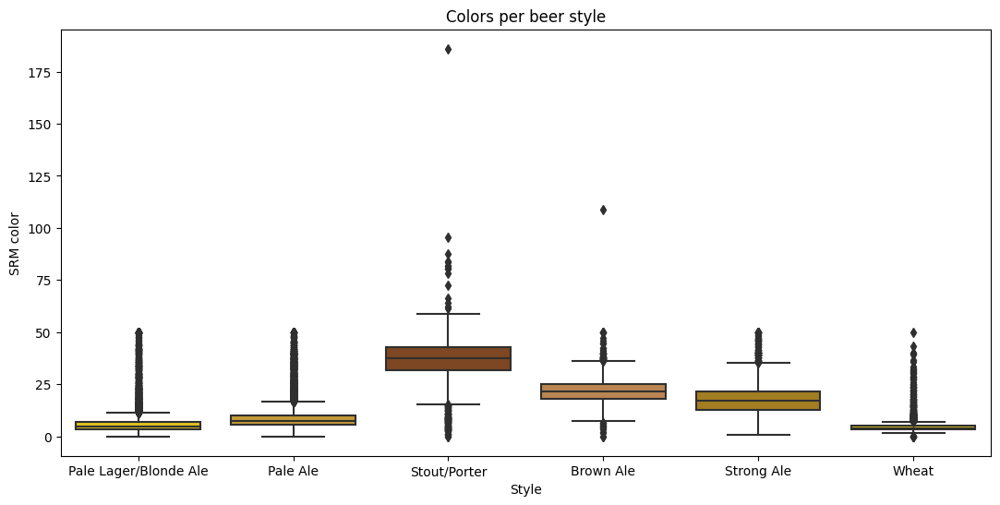
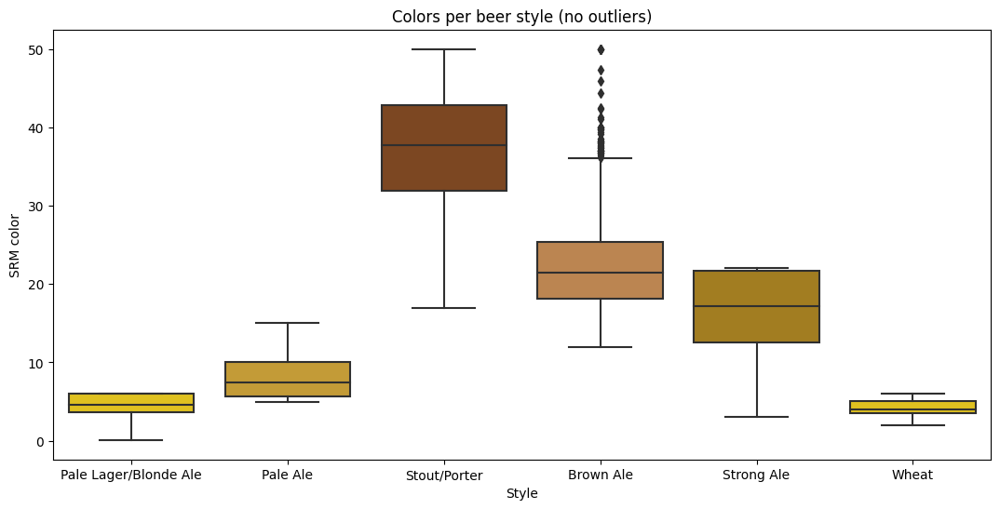

# Project Memo


Initially, the dataset had the following columns:

```Python
['BeerID', 'Name', 'URL', 'Style', 'StyleID', 'Size(L)', 'OG', 'FG', 'ABV', 'IBU', 'Color', 'BoilSize', 'BoilTime', 'BoilGravity', 'Efficiency', 'MashThickness', 'SugarScale', 'BrewMethod', 'PitchRate', 'PrimaryTemp', 'PrimingMethod', 'PrimingAmount', 'UserId']
```
The data source, [Brewersfriend.com](https://www.brewersfriend.com/beer-charts/), is a website focused on craft beer recipes for enthusiasts to brew and share.

### Data Cleaning
(Details about this process in the file [02cleaning.ipynb]('../notebooks/02limpieza.ipynb')).

After examining the data correlations using heatmaps with Pearson, Kendall, and Spearman coefficients, I discarded clearly unnecessary columns.

I also tried methods like **OneHot Encoder** or **Label Encoder** for other columns to establish less obvious relationships, but it didn't help much.

Thus, the columns of interest for the model turned out to be only:

+ Alcohol By Volume (ABV)
+ International Bitterness Units (IBU)
+ Color (SRM)

Once the variables to work with were determined, data cleaning was performed:

+ **Comprehensive mapping of beer styles**. Initially, there were 175 types of beer in the dataset, which were classified into six main styles (although some were eliminated for not fitting into any or being too peculiar):
    - Wheat
    - Pale Lager/Blonde Ale
    - Pale Ale
    - Strong Ale
    - Brown Ale
    - Stout/Porter
+ (These types were used to assign ordered numerical values based on color. I repeated the same process to order them by bitterness level, but the results were not as conclusive, so the color mapping was definitive).
| Style | Color_code |
| -------- | -------- |
| Wheat | 0 |
| Pale Lager/Blonde Ale | 1 |
| Brown Ale | 2 |
| Strong Ale | 3 |
| Brown Ale | 4 |
| Stout/Porter | 5 |

+ Removal of duplicate beers;
+ Visualization of variable distributions by styles (``` groupby() ```)

-----------------------------------
### Variable Transformation and Visualizations
+ Removal of outliers and correction of incorrect values (removal of 0.0% beers, setting limits for the Color variable value according to the SRM scale...)
(Details about this process in the file [03cleaning_EDA.ipynb]('../notebooks/03limpiezaEDA.ipynb'))

+ Once outliers were corrected, the distribution of values could be visualized more clearly:


### Model Training

#### Logistic Regression
(Details about this process in the file [04Training_evaluation_LR.ipynb]('../notebooks/04Entrenamiento_evaluacion_LRpruebas.ipynb'))

+ After dividing the dataset into train and test, defining the predictor variables (```X_train=train[['ABV','IBU','Color']]```) and the variable to predict (```y_train=train['Style_color']```), it is important to balance the classes since there are many more beers of some types than others. For this, a **RandomUnderSampler** is used.

+ Then, I conducted a first test with a simple logistic regression (both scaling the data and not scaling it), which gave me acceptable metrics (```f1_score 0.815``` without scaling).


+ I repeated this process using the column that ordered styles by their bitterness level (IBU) as the target, but the results were very similar, so from here onwards, **Style_color** was always used.

### GridSearches, Pipelines, and Final Model
(Details about this process in the file [05Training_evaluation_best_model.ipynb]('../notebooks/05Entrenamiento_evaluacion_best_model.ipynb'))

+ In this penultimate notebook, I tried two pipelines to determine the best classification model and its respective parameters through a Grid Search. First, scaling the data and then without scaling, which turned out to be the best option.
Of the chosen models, the winner turned out to be the Gradient Boosting Classifier, with quite good metrics (```f1_score 0.91```)

Although it still struggles a bit to distinguish between blonde beers, it is a very good model for all other beer styles.

#### Clustering and KMeans
+ I also tried to create an unsupervised learning model (clustering). According to the metrics, I tried dividing the dataset into 2 and 5 clusters, but the results were not too good.
+ The same thing happened when I tried to perform a Randomized Search instead off a supervised Grid Search.

#### Other Tests and Models
(Details about this process in the file [06Training_evaluation_GS2.ipynb]('../notebooks/06Entrenamiento_evaluacion_GS2pruebas.ipynb'))

+ Finally, I decided to create two more pipelines with Grid Search:
    - One with the remaining models to try (it did not improve the results)
    


    - Another one increasing the parameters of the winning Gradient Boosting, which also did not improve the metrics
    

In conclusion, the best model was the initial Gradient Boosting, without scaling the data, perhaps because the next ones were overfitted. The parameters used can be consulted [here](../models/final_model_config.yaml).

## Streamlit app: Try the model yourself
Follow [this link](https://predicting-beer-styles-with-machine-learning.streamlit.app/) if you want to test the model on Streamlit.